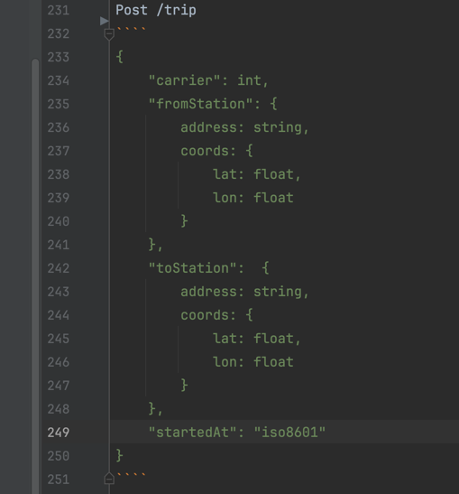

## Api грузовиков

### получение заявки, если оставить параметр null, то он не будет использоваться в фильтре
Post /cargo_request/search?page_number=int&page_size=int
````
{
    "id": "uuid",
    "consignerId": int,
    "recipientId": int,
    "status": "string",
    "createdFrom": "iso8601",
    "createdTo": "iso8601"
}
````

Http status: 200
````
{
  "cargoRequests": [
    {
        "id": "uuid",
        "consignerId": int,
        "recipientId": int,
        "fromStation": {
            address: string,
            coords: {
                lat: float,
                lon: float
            }
        },
        "toStation": {
            address: string,
            coords: {
                lat: float,
                lon: float
            }
        },
        "createdAt": long,
        "deadline": long,
        "routeId": "uuid",
        "tripId": "uuid",
        "price": "decimal(10, 2)",
        "status": "string",
        "receiveCode": "string"
    }
  ]
}
````

### создание заявки
Post /cargo_request
````
{
    "consignerId": int,
    "recipientId": int,
    "fromStation": {
        address: string,
        coords: {
            lat: float,
            lon: float
        }
    },
    "toStation":  {
        address: string,
        coords: {
            lat: float,
            lon: float
        }
    },
    "deadline": "iso8601",
    "maxPrice": "decimal(10, 2)"
}
````

Http status: 200
````
{
  "id": "uuid"
}
````

### получение типов грузов
Get /cargo/types

Http status: 200
````
{
  "cargoTypes": [
    {
      "id": int,
      "type": "string",
      "fragile": "boolean"
    }
  ]
}
````

### создание груза
Post /cargo
````
{
  cargo: [
    {
      "length": int,
      "height": int,
      "width": int,
      "weight": int,
      "cargoType": int,
      "description": "string",
      "worth": int,
      "cargoRequestId": int
    }
  ]
}
````

Http status: 200
````
{
  ids: [
    int,
    int
  ]
}
````

### создание получателя
Post /recipients
````
{
  "firstname": "string",
  "secondname": "string",
  "thirdname": "string",
  "phone": "string",
  "email": "string"
}
````

Http status: 200
````
{
  "id: int
}
````

### получение поездки для заявки
Get /trip/cargo_request/{id}

Http status: 200
````
{
  "id": "uuid",
  "fromStation": {
    address: string,
    coords: {
        lat: float,
        lon: float
    }
  },
  "toStation": {
    address: string,
    coords: {
        lat: float,
        lon: float
    }
  },
  "startedAt": long,
  "calculatedEndAt": long,
  "actualEndAt": long,
  "price": "decimal(10, 2)",
  "status": "string",
  "carrierId": int,
  "carId": int
}
````

### получение маршрута для заявки
### получение маршрута для поездки
- Get /routes/cargo_request/{uuid}?withPoints=boolean
- Get /routes/trip/{uuid}?withPoints=boolean

Http status: 200
````
{
  "id": "uuid",
  "stations": [
    {
      "station": {
        address: string,
        coords: {
            lat: float,
            lon: float
        }
      },
      "distance": int,
      "orderNum": int,
      "arrivalAt": long,
      "departureTime": long
    }
  ],
  "points": [
    float, float,
    float, float,
    ...
  ]
}
````

точки будут передаваться парно, т.е.
- 1 число - lat первой точки, 2 число - lon первой точки
- 3 число - lat второй точки, 4 число - lon второй точки

## Грузоперевозчик

### Получение поездки по перевозчику
если параметр не передан, то он не будет использоваться в запросе

Get /trip?tripId=uuid&carrierId=int

Http status: 200
````
{
    "id": "uuid,
    "route_id": "uuid",
    "fromStation": {
        address: string,
        coords: {
            lat: float,
            lon: float
        }
    },
    "toStation":  {
        address: string,
        coords: {
            lat: float,
            lon: float
        }
    },
    "startedAt": utc,
    "calculatedEndAt": utc,
    "actualEndAt": utc,
    "price": decimal(10, 2),
    "status": "string",
    "carrierId": int,
    "carId": int
}

````

### создание поездки
Post /trip
````
{
    "carrier": int,
    "fromStation": {
        address: string,
        coords: {
            lat: float,
            lon: float
        }
    },
    "toStation":  {
        address: string,
        coords: {
            lat: float,
            lon: float
        }
    },
    "startedAt": "iso8601"
}
````

Http status: 200
````
{
  "id": uuid
}
````

### получение заявок для поездки
Get /cargo_request/trip/{uuid}?cargoLenghtMax=int&cargoWidthMax=int&cargoHeightMax=int&cargoType=int&deadline=iso8601?minPrice=int

Http status: 200
````
{
  "cargoRequests": [
    {
        "id": "uuid",
        "consignerId": int,
        "recipientId": int,
        "fromStation": {
            address: string,
            coords: {
                lat: float,
                lon: float
            }
        },
        "toStation": {
            address: string,
            coords: {
                lat: float,
                lon: float
            }
        },
        "createdAt": long,
        "deadline": long,
        "routeId": "uuid",
        "tripId": "uuid",
        "price": "decimal(10, 2)",
        "status": "string",
        "receiveCode": "string"
    }
  ]
}
````

### начать поездку
PATCH /trip/{uuid}/start
````
{
    "cargoRequests": [
        "uuid",
        "uuid",
        ...
    ]
}
````

Http status: 200

### подтверждение доставки груза
PATCH /cargo_request/{uuid}/finish/code/{int}

Http status: 200

### завершение поездки
PATCH /trip/{uuid}/finish/status/{tripStatus}

Http status: 200

## Внутренние запросы (фронту не нужны)

### сохранение отправителя в системе
Post /consigner
````
{
  "id": int
}

````

Http status: 200

### сохранение водителя в системе
Post /carrier
````
{
  "id": int,
  "driver_category": "string"
}
````

Http status: 200

## статусы
статусы для заявок, грузов, поездок - констаны в string

### cargoRequestStatus
````
PENDING, IN_PROGRESS, COMPLETED, CANCELED
````

### tripStatus
````
PENDING, IN_PROGRESS, COMPLETED, CANCELED
````

## форматы
### порядок сортировки
````
ASC
DESC
````

### decimal(10, 2)
````
предполагается, что будет строка типа "7.47", 
надо договориться, как правильно передавать цены
````

### timestamp (long)
время возвращается в секундах UTC https://www.unixtimestamp.com

### iso8601
````
2025-11-03T05:16:38+00:00
````

## ошибки
если пришла ошибка без описания - описания не будет;
http status ошибки, если повезет, 
будет адекватный

HttpStatus: xxx
````
{
  "errorType": "string",
  "message": "ebites kak hotite"
}
````

errorType - константы, сообщим позже